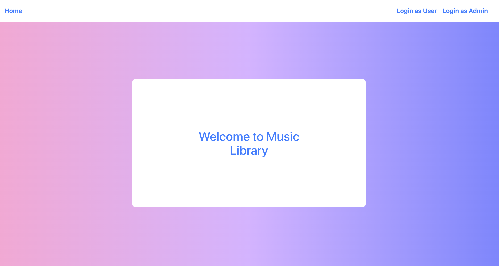
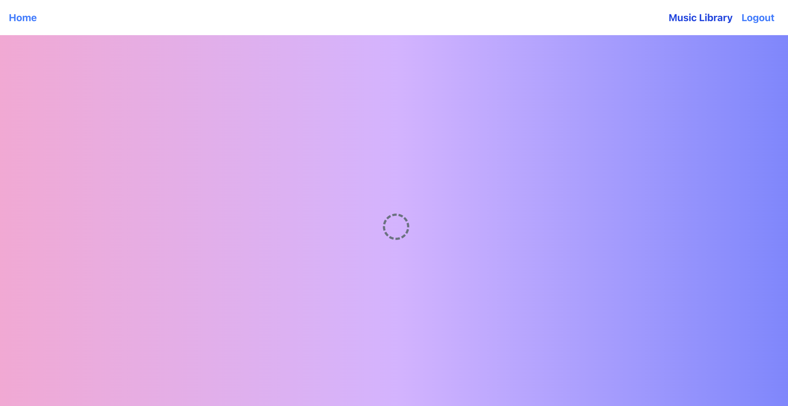
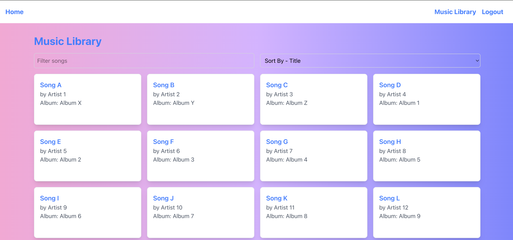
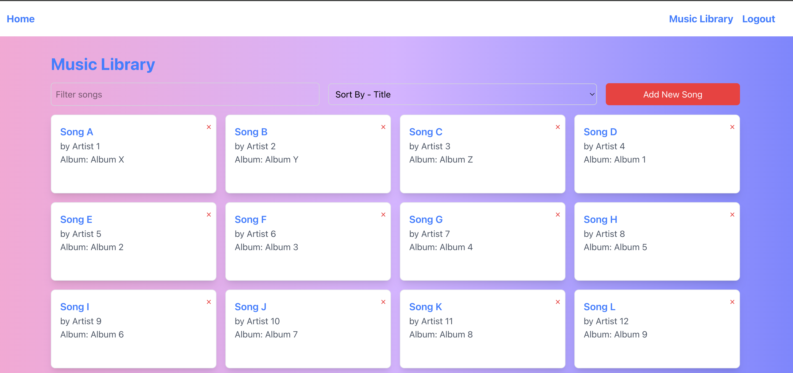

# Microfrontend Music Library Project

This project is a micro-frontend architecture built with **React**, **Vite**, **TypeScript**, and **Module Federation**. It consists of two applications:

- **Host App**: Loads and displays the Music Library microfrontend.
- **Remote App**: Exposes the Music Library component to be loaded by the Host App.

---

## Project Structure

```
root-directory/
│
├── host-app/       # Host application (React + Vite + TypeScript)
│
├── remote-app/     # Remote application (Music Library microfrontend)
│
├── package.json
└── pnpm-workspace.yaml
```

---

## Links

- **Host App**: [https://host-music-library-app.netlify.app/](https://host-music-library-app.netlify.app/)
- **Remote App**: [https://remote-music-library-app.netlify.app/](https://remote-music-library-app.netlify.app/)

---

## Screenshots

### Host App Home Page



### Music Library Page

## 

## 

## 

## 

## Getting Started

### Prerequisites

- **Node.js** v16 or later
- **PNPM** (Package Manager)

### Installation

Clone the repository and install dependencies using PNPM:

```bash
git clone <repository-url>
cd root-directory
pnpm install
```

### Running Applications Locally

#### Remote App (Music Library)

```bash
cd remote-app
pnpm build
pnpm preview --port 5001 --strictPort
```

#### Host App

```bash
cd host-app
pnpm dev --port 5000 --strictPort
```

---

## Deployment

This project is deployed on **Netlify**.

- **Host App** deployed at: [https://host-music-library-app.netlify.app/](https://host-music-library-app.netlify.app/)
- **Remote App** deployed at: [https://remote-music-library-app.netlify.app/](https://remote-music-library-app.netlify.app/)

### Netlify Deployment Configuration

- **Branch to deploy**: `main`
- **Build command**: `pnpm build`
- **Publish directory**: `dist`
- **Base directory**:
  - Host App: `host-app`
  - Remote App: `remote-app`
- **Environment Variables**:
  - `VITE_REMOTE_URL`: URL of the remote app (e.g., `https://remote-music-library-app.netlify.app`)
  - `VITE_BASE`: `/`

---

## Key Features

- **Microfrontend Architecture** with Module Federation.
- **Vite** for fast build and development.
- **React** with **TypeScript** for type safety.
- **PNPM** workspace for managing dependencies.
- **Tailwind CSS** for styling.

---

## Scripts

- **Install dependencies**: `pnpm install`
- **Build**: `pnpm build`
- **Start development server**: `pnpm dev`
- **Run preview**: `pnpm preview`
- **Run tests**: `pnpm test`

---

## Author

**Nitin Mangrule**

---

Happy coding! 🎵
